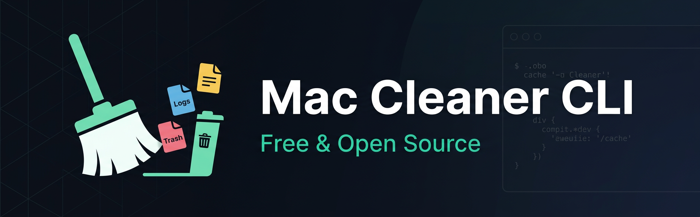

# mac-cleaner-cli

<p align="center">
  
</p>

<p align="center">
  Free up disk space on macOS with a single command. Removes caches, logs, Homebrew leftovers, Xcode DerivedData, and junk files — all from your terminal.<br>
  No subscription. No telemetry. No bloatware.
</p>

<p align="center">
  <a href="https://www.npmjs.com/package/mac-cleaner-cli"></a>
  <a href="https://www.npmjs.com/package/mac-cleaner-cli"></a>
  <a href="https://github.com/guhcostan/mac-cleaner-cli/actions/workflows/ci.yml"></a>
  <a href="https://opensource.org/licenses/MIT"></a>
</p>

<p align="center">
  <a href="https://nodejs.org"></a>
  <a href="https://www.apple.com/macos/"></a>
  <a href="https://www.typescriptlang.org/"></a>
  <a href="https://socket.dev/npm/package/mac-cleaner-cli"></a>
</p>

<p align="center">
  <a href="https://github.com/guhcostan/mac-cleaner-cli/stargazers"></a>
  <a href="https://github.com/guhcostan/mac-cleaner-cli/network/members"></a>
</p>

<p align="center">
  <a href="https://github.com/sponsors/guhcostan"></a>
</p>

<p align="center">
  <strong>🪟 Also available for Windows:</strong> <a href="https://github.com/guhcostan/windows-cleaner-cli">windows-cleaner-cli</a>
</p>

---

## ⚡ Quick Start

```bash
npx mac-cleaner-cli
```

That's it. No installation needed. The CLI will:

1. 🔍 **Scan** your Mac for cleanable files
2. 📋 **Show** you what was found with sizes
3. ✅ **Let you select** exactly what to clean
4. 🗑️ **Clean** only what you chose

## 🎬 See It In Action

```
$ npx mac-cleaner-cli

🧹 Mac Cleaner CLI
──────────────────────────────────────────────────────

Scanning your Mac for cleanable files...

Found 44.8 GB that can be cleaned:

? Select categories to clean (space to toggle, enter to confirm):
❯ ◯ ● Trash                            2.1 GB (45 items)
  ◯ ● Browser Cache                    1.5 GB (3 items)
  ◯ ● Temporary Files                549.2 MB (622 items)
  ◯ ● User Cache Files                15.5 GB (118 items)
  ◯ ● Development Cache               21.9 GB (14 items)
↑↓ navigate • ← back • → enter • space select • a all • i invert • ⏎ submit

# Press → on a supported category to browse and select specific folders/files
? Browsing: Root Scan Results
❯ ◯ 📂 com.apple.Safari                         1.2 GB
  ◯ 📂 com.google.Chrome                        2.3 GB
  ◯ 📂 com.spotify.client                     824.1 MB
↑↓ navigate • ← back • → enter • space select • a all • i invert • ⏎ submit

Summary:
  Items to delete: 802
  Space to free: 41.5 GB

? Proceed with cleaning? (Y/n)

✓ Cleaning Complete!
──────────────────────────────────────────────────────
  Trash                          ✓ 2.1 GB freed
  Browser Cache                  ✓ 1.5 GB freed
  Temporary Files                ✓ 549.2 MB freed
  User Cache Files               ✓ 15.5 GB freed
  Development Cache              ✓ 21.9 GB freed

──────────────────────────────────────────────────────
🎉 Freed 41.5 GB of disk space!
   Cleaned 802 items
```

## ✨ Features

| Feature | Description |
|---------|-------------|
| 🚀 **One Command** | Just run `npx mac-cleaner-cli` — no complex setup |
| 🎯 **Interactive** | Select exactly what you want to clean with checkboxes |
| 📁 **File Explorer** | Drill down (`→`) into categories to select specific folders/files |
| 🛡️ **Safe by Default** | Risky items hidden unless you use `--risky` |
| 🔍 **Smart Scanning** | Finds caches, logs, dev files, browser data, and more |
| 📱 **App Uninstaller** | Remove apps completely with all associated files |
| 🔧 **Maintenance** | Flush DNS cache, free purgeable space |
| 🔒 **Privacy First** | 100% offline — no data ever leaves your machine |
| 📦 **Minimal Dependencies** | Only 5 runtime deps, all from trusted maintainers |

## 💰 vs. Paid Alternatives

| | Mac Cleaner CLI | CleanMyMac X | DaisyDisk |
|---|---|---|---|
| **Price** | **Free** | $39.95/year | $9.99 one-time |
| **Open Source** | ✅ | ❌ | ❌ |
| **Telemetry / Analytics** | ❌ None | ⚠️ Yes | ⚠️ Yes |
| **Works via terminal** | ✅ | ❌ | ❌ |
| **CI/CD friendly** | ✅ | ❌ | ❌ |
| **Customizable** | ✅ Fork it | ❌ | ❌ |
| **App Uninstaller** | ✅ | ✅ | ❌ |
| **File-level selection** | ✅ | ✅ | ✅ |

## 🎯 What It Cleans

### 🟢 Safe (always safe to delete)

| Category | What it cleans |
|----------|---------------|
| `trash` | Files in the Trash bin |
| `temp-files` | Temporary files in /tmp and /var/folders |
| `browser-cache` | Chrome, Safari, Firefox, Arc cache |
| `homebrew` | Homebrew download cache |
| `docker` | Unused Docker images, containers, volumes |

### 🟡 Moderate (generally safe)

| Category | What it cleans |
|----------|---------------|
| `system-cache` | Application caches in ~/Library/Caches |
| `system-logs` | System and application logs |
| `dev-cache` | npm, yarn, pip, Xcode DerivedData, CocoaPods |
| `node-modules` | Orphaned node_modules in old projects |

### 🔴 Risky (use `--risky` flag)

| Category | What it cleans |
|----------|---------------|
| `downloads` | Downloads older than 30 days |
| `ios-backups` | iPhone and iPad backup files |
| `mail-attachments` | Downloaded email attachments |
| `duplicates` | Duplicate files (keeps newest) |
| `large-files` | Files larger than 500MB |
| `language-files` | Unused language localizations |

## 📖 Usage

### Basic Usage

```bash
# Interactive mode — scan, select, and clean
npx mac-cleaner-cli

# Include risky categories
npx mac-cleaner-cli --risky

# Enable file picker for all categories
npx mac-cleaner-cli --risky -f
```

### Folder-Level Selection (Interactive)

In interactive mode, press `→` on supported categories to drill into specific folders/files:

- `↑↓` navigate • `←` back • `→` enter • `space` select • `a` all • `i` invert • `⏎` submit

Supported categories: User Cache Files, Temporary Files, System Log Files, Development Cache, Browser Cache, Homebrew Cache.

### Uninstall Apps

Remove applications completely with all their preferences, caches, and support files:

```bash
npx mac-cleaner-cli uninstall
```

### Maintenance Tasks

```bash
# Flush DNS cache (may require sudo)
npx mac-cleaner-cli maintenance --dns

# Free purgeable space
npx mac-cleaner-cli maintenance --purgeable
```

### Other Commands

```bash
# List all available categories
npx mac-cleaner-cli categories

# Manage configuration
npx mac-cleaner-cli config --init
npx mac-cleaner-cli config --show

# Manage backups
npx mac-cleaner-cli backup --list
npx mac-cleaner-cli backup --clean
```

### Flags

```bash
-V, --version          Show version number
-h, --help             Show help
-r, --risky            Include risky categories
-f, --file-picker      Force file picker for ALL categories
-A, --absolute-paths   Show absolute paths
    --no-progress      Disable progress bars
```

## 💻 Global Installation

If you use this tool frequently:

```bash
npm install -g mac-cleaner-cli
mac-cleaner-cli
```

## 🔒 Security

| | |
|---|---|
| ✅ **Open Source** | All code publicly available for audit |
| ✅ **No Network** | Operates 100% offline |
| ✅ **No Root Required** | All operations run as current user |
| ✅ **Minimal Deps** | Only 5 runtime dependencies |
| ✅ **CI/CD** | Every release tested with TypeScript, ESLint, and automated tests |
| ✅ **Socket.dev** | Dependencies monitored for supply chain attacks |

Found a vulnerability? Report it via [GitHub Security Advisories](https://github.com/guhcostan/mac-cleaner-cli/security/advisories/new).

## 🛠️ Development

```bash
git clone https://github.com/guhcostan/mac-cleaner-cli.git
cd mac-cleaner-cli
bun install
bun run dev      # Run in dev mode
bun run test     # Run tests
bun run lint     # Run linter
bun run build    # Build for production
```

## 🤝 Contributing

Contributions are very welcome! Whether it's a new scanner, a bug fix, or a documentation improvement — we'd love your help.

**Read the full guide:** [CONTRIBUTING.md](CONTRIBUTING.md)

Quick steps:
1. Fork the repo
2. Create your branch: `git checkout -b feat/my-feature`
3. Make your changes and add tests
4. Run `bun run lint && bun run test`
5. Open a Pull Request

Looking for a place to start? Check issues labeled [`good first issue`](https://github.com/guhcostan/mac-cleaner-cli/labels/good%20first%20issue) or [`help wanted`](https://github.com/guhcostan/mac-cleaner-cli/labels/help%20wanted).

## 💬 Community

- [GitHub Discussions](https://github.com/guhcostan/mac-cleaner-cli/discussions) — questions, ideas, show & tell
- [Issues](https://github.com/guhcostan/mac-cleaner-cli/issues) — bug reports and feature requests

## ⭐ Star History

If this tool saved you disk space, a star goes a long way! It helps more Mac users discover this free alternative to paid cleaners.

[](https://star-history.com/#guhcostan/mac-cleaner-cli&Date)

## 💚 Support

If this tool saved you time or disk space, consider supporting the project!

<p align="center">
  <a href="https://github.com/sponsors/guhcostan"></a>
</p>

Your support helps maintain and improve this tool. Thank you! 🙏

## 📄 License

MIT License — see [LICENSE](LICENSE) for details.

---

<p align="center">
  <strong>⚠️ Disclaimer</strong><br>
  This tool deletes files from your system. While we've implemented safety measures, always ensure you have backups of important data.
</p>

<p align="center">
  Made with ❤️ for Mac users everywhere
</p>
