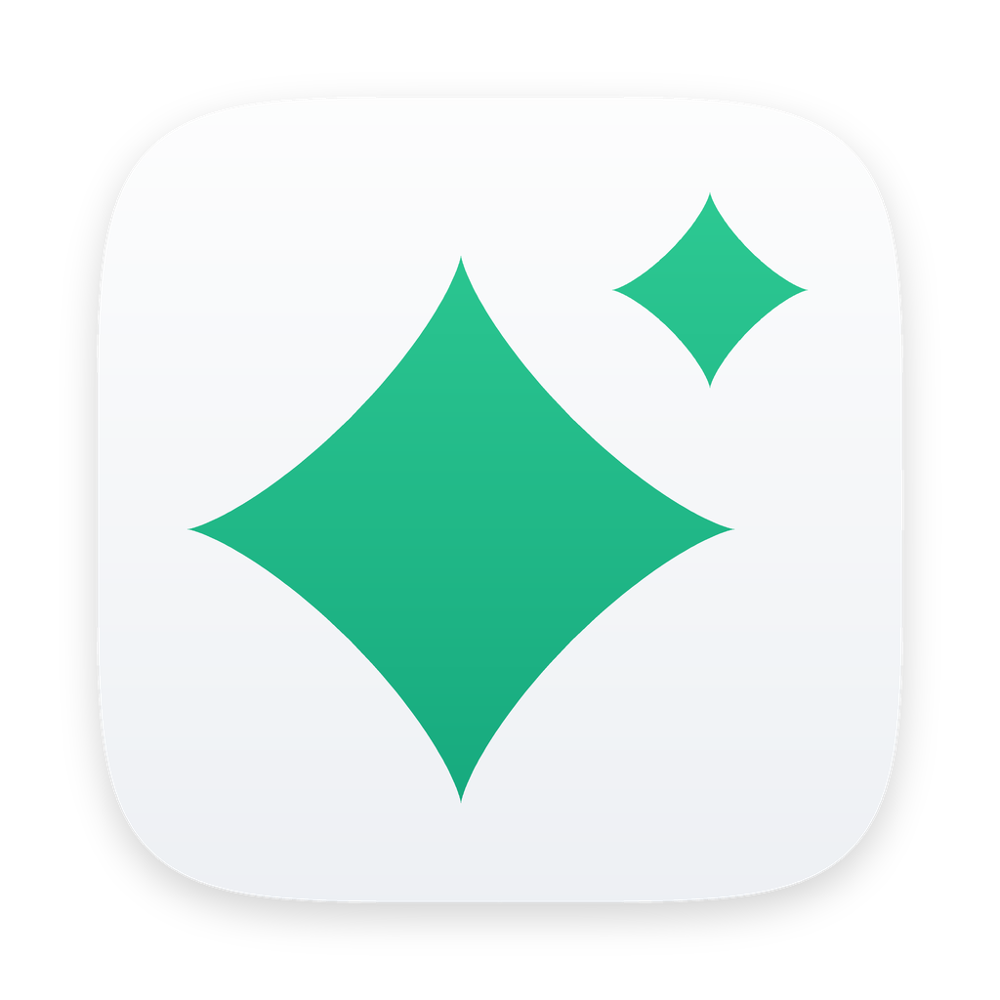

# Mac Cleaner — Desktop (menu bar app)

A macOS menu bar app that keeps your Mac clean on its own. It uses the same scanners as
[`mac-cleaner-cli`](../README.md) (they are bundled straight from `../src`), so every
category, safety rule and protected-path check of the CLI applies here too.

<p align="center"></p>

## What it does

| | |
|---|---|
| **Lives in the menu bar** | A sparkle icon at the top of the screen. Click it to open the popover; right click for a quick menu. There is no Dock icon. |
| **Daily automatic clean** | Once a day at the time you pick (default 10:00) it quietly cleans the categories you selected. If the Mac was asleep or off at that time, it runs as soon as it wakes. It never runs twice on the same day, and right after install it waits for the first scheduled time instead of cleaning immediately. |
| **Clean Now** | Runs the same selection as the daily clean, on demand. |
| **Deep Clean (hard delete)** | Scans many more places (system caches, dev caches, node_modules, Docker, Trash… and, if you opt in, risky ones like old Downloads or iOS backups), shows what was found per category with the largest items, and permanently deletes only what you tick, after an explicit confirmation. |
| **Shows what it removed** | Every run is saved to History with the space freed per category and any errors. The home screen shows the total freed and the last run. A notification is shown after each automatic clean. |

### Safety

- Unattended runs (daily and Clean Now) can only use categories that are **not** marked risky. This is enforced in the main process, not just in the UI.
- Automatic runs skip temp files touched in the last 24 hours (configurable) because running apps may still be using them.
- Deep Clean never deletes without a scan preview and a confirmation, and rescans if the preview is older than 15 minutes.
- All deletions go through the CLI's `removeItem`, which refuses system paths, `/` and your home folder, and never follows symlinks.
- The UI runs in a sandboxed renderer with a strict Content Security Policy and no Node.js access; it can only call the handful of actions exposed by the preload script.

### Default automatic categories

`temp-files`, `browser-cache`, `homebrew`, `system-logs`. You can add any other non-risky category (User Cache, Trash, Development Cache, Docker…) in **Settings**.

## Install

Download `Mac-Cleaner-<version>-arm64.dmg` (Apple Silicon) or `-x64.dmg` (Intel) from
[Releases](https://github.com/guhcostan/mac-cleaner-cli/releases), open it and drag
**Mac Cleaner** to Applications.

Then grant **Full Disk Access** (System Settings → Privacy & Security → Full Disk Access →
add Mac Cleaner). Without it macOS hides some caches from the app; the popover shows a
banner with a shortcut when access is missing.

> **Unsigned builds:** until the project has an Apple Developer ID, release builds are
> ad-hoc signed. macOS will say the app "cannot be opened because the developer cannot be
> verified". Right click the app → **Open** → **Open** once, or run
> `xattr -dr com.apple.quarantine "/Applications/Mac Cleaner.app"`.

## Develop

Requires Bun (or npm) and Node 22+. The app bundles code from the CLI, so install the root
dependencies too.

```bash
bun install              # at the repository root
cd desktop
bun install
bun run start            # build (with sourcemaps) and launch Electron
bun run test             # unit tests for the scheduler, settings, store and clean engine
bun run typecheck
bun run dist             # package .dmg + .zip for arm64 and x64 into desktop/release (macOS only)
```

State (settings + history) is stored in `~/Library/Application Support/Mac Cleaner/state.json`.

### Layout

```
desktop/
├── src/main/          Electron main process
│   ├── main.ts        tray icon, popover window, IPC, scheduler timer, notifications
│   ├── controller.ts  orchestrates scans/cleans, busy guard, state for the UI (Electron-free)
│   ├── engine.ts      scan + clean on top of the CLI scanners (Electron-free)
│   ├── schedule.ts    "is the daily run due?" logic (pure)
│   ├── settings.ts    defaults + validation of settings coming from the UI
│   └── store.ts       JSON persistence with atomic writes
├── src/preload/       the only bridge between UI and main process (window.cleaner)
├── src/renderer/      popover UI (plain TypeScript + CSS, no framework)
├── src/shared/        types shared by main, preload and renderer
├── assets/            menu bar template icons
├── build/             app icon + entitlements for packaging
└── scripts/           esbuild bundler and icon generator
```

### Why Electron

The scanners are TypeScript, so Electron lets the app reuse them as-is (no rewrite in
Swift, no bundled Node runtime to call the CLI through a subprocess), keeps one language in
the repo, and lets the logic be unit-tested on any OS. The trade-off is a bigger download
(~100 MB) than a native SwiftUI `MenuBarExtra` app would have.

## Releasing

The **Desktop App** workflow (`.github/workflows/desktop.yml`) builds the app on macOS for
every PR/push that touches `desktop/` or `src/`, uploads the `.dmg`/`.zip` as workflow
artifacts, and attaches them to the GitHub release when a release is published.

To ship a signed and notarized app, add these repository secrets:

| Secret | Value |
|---|---|
| `MAC_CERTIFICATE_P12_BASE64` | base64 of your "Developer ID Application" certificate (.p12) |
| `MAC_CERTIFICATE_PASSWORD` | password of the .p12 |
| `APPLE_ID` | Apple ID email used for notarization |
| `APPLE_APP_SPECIFIC_PASSWORD` | app-specific password for that Apple ID |
| `APPLE_TEAM_ID` | your 10-character team ID |

Without them the build is ad-hoc signed (see the note in [Install](#install)).

Bump `version` in `desktop/package.json` before a release: it is the version shown in the
app and in the file names.
